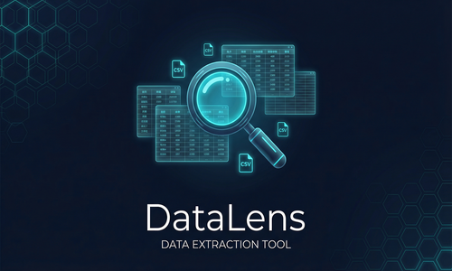

# 鬼谷八荒 DataLens — 資料匯出工具 MOD

  

**鬼谷八荒 DataLens** 是一款[鬼谷八荒（Tale of Immortal）](https://store.steampowered.com/app/1468810/)的資料匯出 MOD，能一鍵將遊戲內配置表匯出為 CSV 檔案，方便 MOD 開發者查表、除錯、分析資料。

## ✨ 功能特色

- **多資料表全量匯出**：氣運、物品、劇情、技能、宗門、NPC、功法 / method 等
- **MOD / 原生自動標記**：每筆資料自動標記 `MOD` 或 `BASE`，一眼分辨來源
- **本地化翻譯**：自動將 name key 翻譯為遊戲內顯示的中文名稱，翻不到時保留原始 key，避免只看到空白或純數字
- **Excel 友善**：UTF-8 BOM 編碼，雙擊即可正確開啟
- **零操作**：進入存檔後自動匯出，無需任何手動操作
- **安全無害**：純讀取操作，不修改任何遊戲資料

## 📦 匯出檔案

所有 CSV 檔案匯出至**遊戲根目錄**（如 `D:\SteamLibrary\steamapps\common\鬼谷八荒\`）：

| 檔案 | 內容 | 欄位 |
|------|------|------|
| `dump_luck.csv` | 氣運（先天/後天） | id, key, display, type, level, isModExtend |
| `dump_item.csv` | 物品 | id, name_key, display, type, className, level, worth, desc_display, isModExtend |
| `dump_drama.csv` | 劇情相關表 | table, row, id, field, value, value_display, isModExtend |
| `dump_skill.csv` | 技能相關表 | table, row, id, field, value, value_display, isModExtend |
| `dump_school.csv` | 宗門 / 職位相關表 | table, row, id, field, value, value_display, isModExtend |
| `dump_npc.csv` | NPC / 角色相關表 | table, row, id, field, value, value_display, isModExtend |
| `dump_method.csv` | 功法 / method 相關表 | table, row, id, field, value, value_display, isModExtend |

## 🔧 安裝方式

1. 確保已安裝 [MelonLoader](https://melonwiki.xyz/)
2. 透過鬼谷八荒的**模組商店**、Steam 的**工作坊**[訂閱](https://steamcommunity.com/sharedfiles/filedetails/?id=3698295479)本MOD
3. 將本MOD放置於本地模組排序的**最下方**(不影響其他MOD，也不會覆蓋於其他MOD。放在最下方是怕會有任一MOD載入時間晚過於本MOD而無法順利獲取其ID)
4. 重新開啟遊戲，等待約 10 秒（300 幀）(由於遊戲載入DLL方式，每次使用均須重啟遊戲)
5. CSV 檔案自動出現在遊戲根目錄

## 📖 使用說明

### 篩選 MOD 資料
在 Excel 中開啟 CSV 後，對 `isModExtend` 欄位篩選 `MOD` 即可只看 MOD 新增的資料。

### 搜尋特定項目
使用 Excel 的搜尋功能（Ctrl+F）在 `display` 欄位搜尋中文名稱。

### 查找 ID
開發 MOD 時需要特定物品/氣運/劇情的 ID，直接在 CSV 中查找即可。

## 🛠️ 技術細節

- **框架**：MelonLoader MOD System
- **語言**：C# (.NET Framework 4.7.2)
- **環境**：IL2CPP
- **遍歷方式**：優先使用 `Count` / `Item[index]` 反射，沒有 Count 時才用索引探測；避免 IL2CPP list 在特定表只輸出幾筆或提前中斷
- **泛用表掃描**：drama / npc / school / skill / method 不再綁死單一 `g.conf.xxx` 欄位，而是掃描 `g.conf` 中名稱匹配的配置表並輸出 primitive 欄位 long-form CSV
- **翻譯**：`ConfLocalText.GetText()` 靜態方法；翻不到時保留原始值
- **編碼**：UTF-8 with BOM

## 📋 版本紀錄

### v1.1.0 (2026-05-28)
- 修正 drama / npc / school 等表因欄位名稱或版本差異而只輸出幾 KB 或缺表的問題
- 修正 method 只看到數字：新增 `dump_method.csv`，並以 long-form 輸出所有 primitive 欄位與可翻譯顯示值
- 改為掃描 `g.conf` 內符合關鍵字的配置表，不再只綁死單一表名
- CSV 明確寫到遊戲根目錄，log 會印出完整路徑

### v1.0.0 (2026-04-03)
- 初始版本
- 支援六大資料表匯出
- MOD/BASE 自動標記
- 本地化翻譯支援

## 👥 貢獻者

- [CingYan](https://github.com/CingYan) — 專案發起人
- Eagle (拍拍) — AI 開發助手，負責程式碼撰寫、反射探測、CSV 匯出邏輯設計

## 📄 授權

MIT License

## 🙏 致謝

- [鬼谷八荒](https://store.steampowered.com/app/1468810/)開發團隊
- [MelonLoader](https://melonwiki.xyz/) 社群
- [OpenClaw](https://github.com/openclaw/openclaw) — AI 基礎設施
